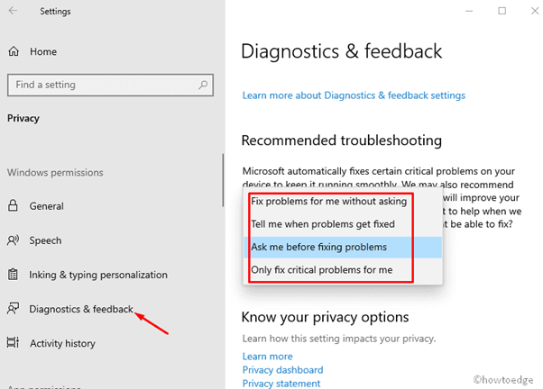

# OS-EX.3-TROUBLESHOOTING-OF-OS---CASE-STUDY
```
Developed By : PASUPULETI SANDEEP
Reg No : 212221230074
```
# AIM:
To study the process of troubleshooting of Operating System.

# STEPS:

1.	Identify the problem.
2.	Establish a theory of Probable Cause
3.	Test the theory to determine cause.
4.	Establish a plan of action to resolve the problem and implement the solution
5.	Verify full system functionality and if applicable implement preventive measures.
6.	Document Findings, action and outcomes

# PROCEDURE:

Step 1: Identify the problem.
OS problems can result from a combination of hardware, software, and network issues. Computer technicians must be able to analyze the problem and determine the cause of the error to repair the computer. This process is called troubleshooting. The first step in the troubleshooting process is to identify the problem. 

Open-ended Questions : 

1. What problems are you having?
2. What OS is installed on the computer?
3. What updates have you performed lately?
4. What programs have you installed recently?
5. What were you doing when the problem was discovered?

Closed-ended Questions:

1. Can you boot the operating system?
2. Can you boot up in safe mood?
3. Have you changed your password recently?
4. Have you seen any error on the computer?
5. Has any one used the computer recently?
6. Has any hardware been added recently?

Step 2: Establish a Theory of Probable Cause
After you have talked to the customer, you can establish a theory of probable causes. 

Common Causes of OS problems : 

1. Incorrect settings in BIOS
2. Caps lock key is set to on
3. Non-bootable media in the floppy drive during computer boot up
4. Password has changed
5. Incorrect monitor settings in control panel
6. Operating system update failure
7. Driver update failure
8. Malware infection
9. Hard drive failure
10. Corrupt operating system files

Step 3: Test the Theory to Determine Cause
After you have developed some theories about what is wrong, test your theories to determine the cause of the problem. The figure shows a list of quick procedures that can help determine the exact cause of the problem or even correct the problem. If a quick procedure does correct the problem, you can jump to verifying the full system functionality. If a quick procedure does not correct the problem, you need to research the problem further to establish the exact cause.

Common steps to determine cause :

1. Log in as a different user
2. Use third party diagnostic software
3. Uninstall recently installed applications
4. Roll back newly updated drivers
5. Determine if new software or software updates have just been installed.
6. Boot into safe mode to determine if the problem is driver-related.
7. Examine device manager for device conflicts
8. Examine event logs for warnings or error

Step 4: Establish a plan of Action to Resolve the Problem and Implement the Solution
After you have determined the exact cause of the problem, establish a plan of action to resolve the problem and implement the solution. 
1. Helpdesk repair logs
2. Other technicians
3. Manufacturer FAQs
4. Technical websites
5. Newsgroups
6. Computer manuals

Step 5: Verify Full System Functionality and Implement Preventive Measures
After you have corrected the problem, verify full system functionality and, if applicable, implement preventive measures.
1. Shutdown the computer and restart it
2. Check event logs to make sure there are no new warnings or error.
3. Check task manager to ensure that the status of all programs is running
4. Re-run any third party diagnostic tools

Step 6: Document Findings, Actions, and Outcomes
In the final step of the troubleshooting process, you must document your findings, actions, and outcomes.
1. Discuss the solution implemented with the customer
2. Have the customer verify that the problem has been solved
3. Provide the customer will all paperwork
4. Document any components used in the repair
5. Document the time spent to resolve the problem

.png)
# RESULT:
Thus the process of troubleshooting of OS is studied.
